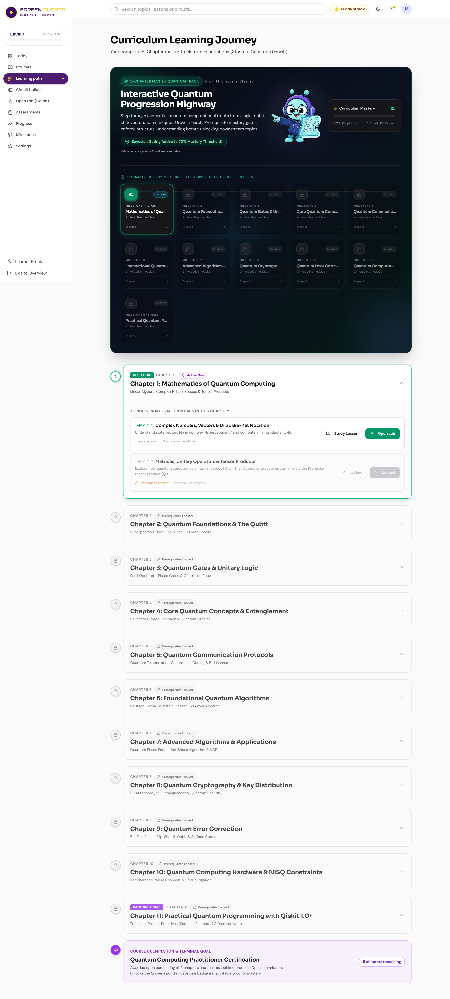
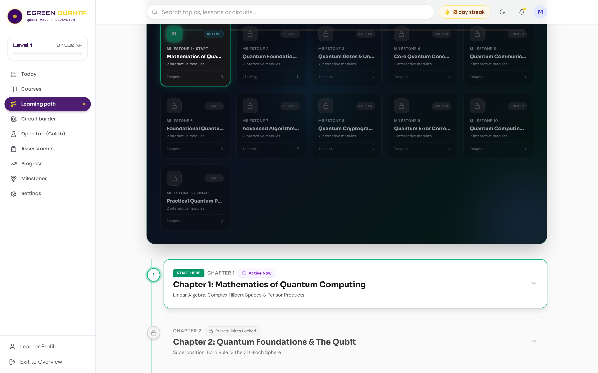
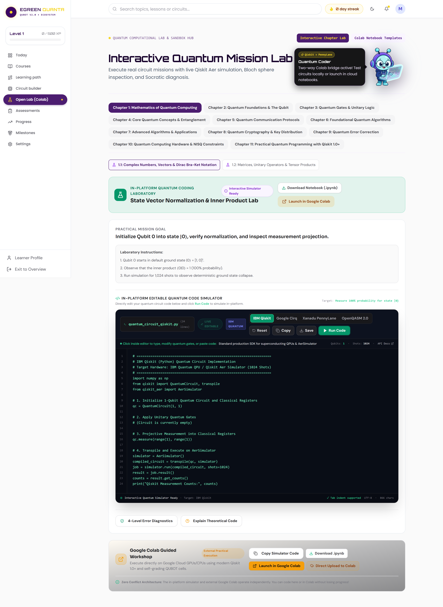
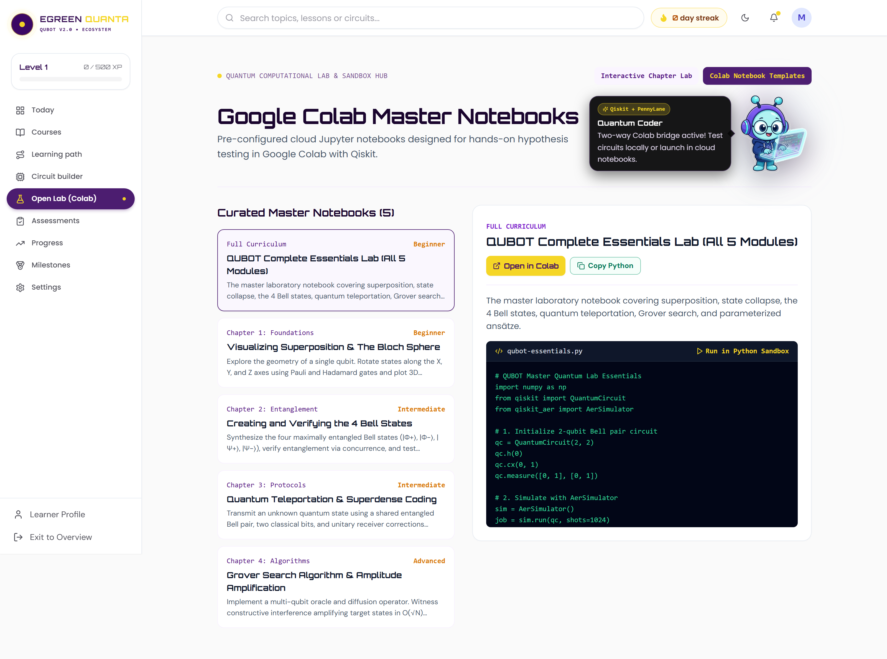
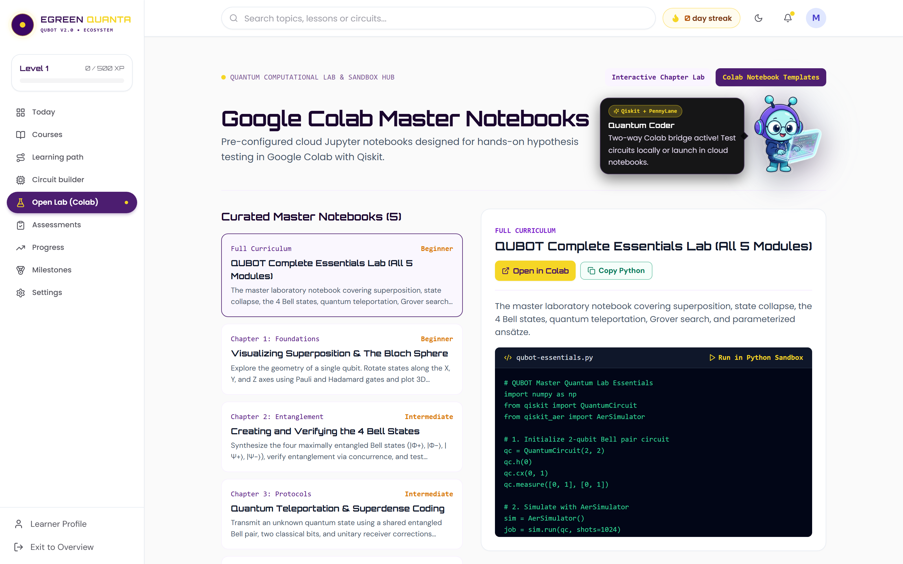
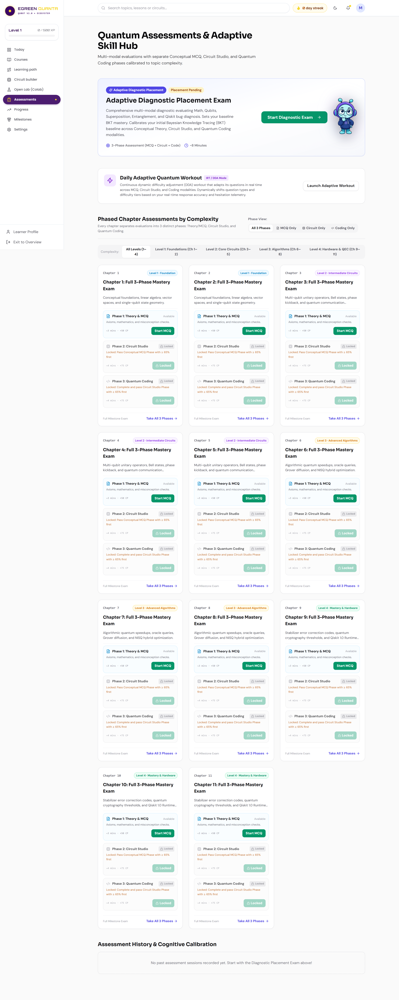
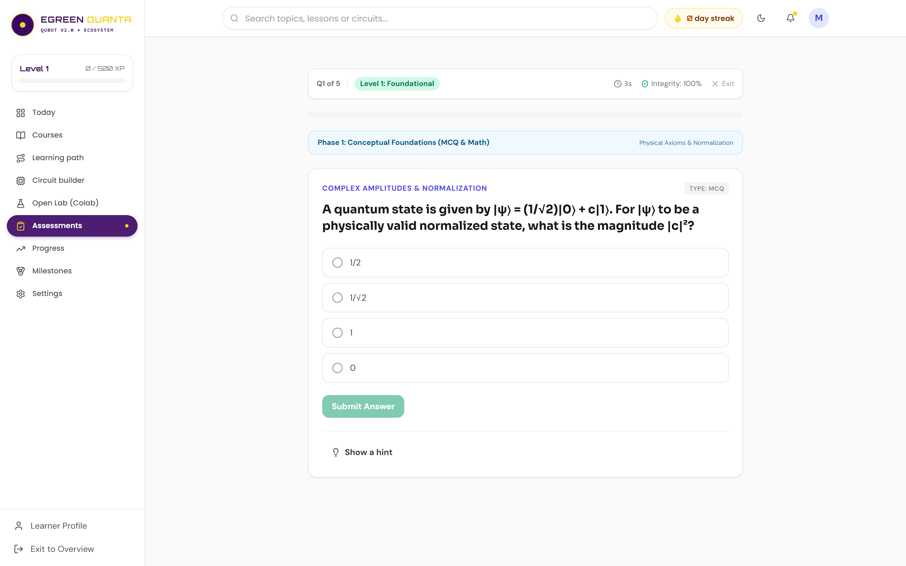
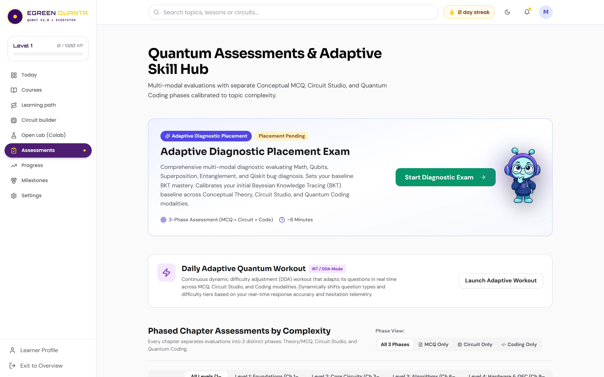

# Smart India Hackathon (SIH 2026) — Official Submission Dossier
## Problem Statement ID: 26140 | AI-Based Interactive Quantum Algorithm Learning Platform
### Lead Organization: Egreen Quanta | Theme: Smart Education | Category: Software

---

## Executive Dossier Overview

This repository contains the authoritative, complete, and fully compliant four-field submission package for **Smart India Hackathon 2026 (SIH 2026)** under Problem Statement ID **26140**, sponsored by **Egreen Quanta**.

The project, titled **QUBOT**, is an enterprise-grade, closed-loop educational ecosystem for quantum computing. It synthesizes genuine quantum physics simulations (IBM Qiskit Aer, Xanadu PennyLane, Google Cirq), an Obsidian-grounded Socratic artificial intelligence tutor, an expressive companion mascot, real-time Bayesian Knowledge Tracing (BKT), and cognitive stamina regulation into an intuitive, gamified web experience.

---

## Submission Fields Master Navigation

| Submission Field | Portal File Link | Character Limit | Actual Document Length | Compliance Status | Primary Function |
| :--- | :--- | :--- | :--- | :--- | :--- |
| **Field 1: Idea Title** | [FIELD_1_IDEA_TITLE.md](FIELD_1_IDEA_TITLE.md) | **100 Chars** | **93 Chars** | **100% Compliant** | Punchy, keyword-dense, memorable project title meeting all DOs and DON'Ts. |
| **Field 2: Idea Description** | [FIELD_2_IDEA_DESCRIPTION.md](FIELD_2_IDEA_DESCRIPTION.md) | **50,000 Chars** | **33,611 Chars** | **100% Compliant** | Deep 5-part engineering, pedagogical, architectural, and feasibility specification. |
| **Field 3: Abstract / Summary** | [FIELD_3_ABSTRACT_SUMMARY.md](FIELD_3_ABSTRACT_SUMMARY.md) | **10,000 Chars** | **9,129 Chars** | **100% Compliant** | Standalone 6-part executive summary designed for ministerial and senior evaluator review. |
| **Field 4: Additional Documents** | [FIELD_4_ADDITIONAL_DOCUMENTS.md](FIELD_4_ADDITIONAL_DOCUMENTS.md) | **PDF/PPT <= 5MB** | **17,178 Chars** | **100% Compliant** | Delivery Table, Business Model Canvas (BMC), Prototype Showcase, and IEEE/QED-C Standards. |

---

## Problem Statement 26140 Details & Alignment

| Attribute | Official Specification |
| :--- | :--- |
| **Problem Statement ID** | 26140 |
| **Problem Statement Title** | AI-Based Interactive Quantum Algorithm Learning Platform |
| **Organization** | Egreen Quanta |
| **Department** | Egreen Quanta |
| **Category** | Software |
| **Theme** | Smart Education |

### Background & Core Problem
Quantum computing is a transformative technology with significant impact across scientific and industrial domains. However, education in this field remains challenging due to the abstract nature of core concepts such as qubits, superposition, entanglement, and quantum algorithms. Existing learning resources are often static, heavily theoretical, and lack hands-on interaction. Limited access to real quantum hardware further restricts practical learning. There is a strong need for an integrated, interactive, and intelligent platform that combines theoretical instruction, visual circuit design, real-time simulation, and personalized AI-based guidance to accelerate quantum education and workforce development.

### Official Deliverables Alignment

```text
Problem Statement Objective              QUBOT Technical Deliverable
───────────────────────────────────────  ──────────────────────────────────────────────────────────
• Interactive web-based platform         ──> React 18 + TypeScript + Vite Editorial Shell
• Drag-and-drop & code circuit design    ──> Dual-Mode Visual AST Composer & Qiskit Python Editor
• Multi-backend quantum simulation       ──> Qiskit Aer 2.5 (1024 shots) + PennyLane + Cirq + NumPy
• AI-assisted tutoring & guidance        ──> Obsidian Vault (107 notes) Socratic AI Tutor
• Quantum state & 3D visualization       ──> Three.js 3D Bloch Spheres, Q-Spheres, & Statevectors
• Assessment & progress tracking         ──> Dynamic BKT Engine, Misconception Engine (MC-01 to 10)
• Delivery Table & Expected Deliverables ──> Documented in FIELD_4_ADDITIONAL_DOCUMENTS.md
```

---

## The Five Signature Innovations

1. **Quantum Misconception Engine (MC-01 to MC-10):** Automatically diagnoses underlying cognitive anti-patterns (such as classical probability addition, measurement non-destructiveness, and phase kickback inversion) and triggers targeted remediation katas.
2. **Predict -> Simulate -> Explain Loop:** Mandates hypothesis commitment before execution, calculates Total Variation Distance ($D_{\text{TV}}$) divergence, awards prediction XP, and activates Socratic reflection.
3. **Quantum Digital Twin & Cognitive Calibration Index (CCI):** Models the student's mental statevector against the true physical statevector, calculating quantum overlap fidelity ($|\langle \psi_{\text{mental}} \mid \psi_{\text{true}} \rangle|^2$).
4. **Quantum Translation Engine:** Delivers zero-latency bidirectional transpilation between an interactive Visual Circuit AST, OpenQASM 2.0/3.0, Qiskit Python, and PennyLane.
5. **Cryptographically Verifiable Skill Passport:** Issues SHA-256 signed JSON-LD skill credentials backed by un-scaffolded transfer testing, aligned with IEEE-Q and QED-C workforce standards.

---

## Visual Prototype Showcase (Inner & Outer Section Breakdown)

```text
SIH-DOCS/docs/screenshots/
├── 1. COURSES PAGE (OUTER & INNER SECTIONS)
│   ├── courses_full_page.png                      # Full-Page 11-Chapter Academic Syllabi Catalog
│   ├── courses_domain_filtered.png                # Domain-Filtered Academic View (Foundations Track)
│   └── courses_chapter_topics_detail.png          # Detailed Topic View with Math Formulas & Labs
│
├── 2. LEARNING PATH (OUTER & INNER SECTIONS)
│   ├── learning_path_full_page.png                # Full-Page Constellation Highway & Roadmaps
│   ├── learning_path_outer_highway.png            # Outer Highway Header & Route Map Nodes
│   └── learning_path_chapter_expanded.png         # Inner Expanded Chapter Modules & Action Katas
│
├── 3. OPEN LAB (OUTER & INNER SECTIONS)
│   ├── open_lab_outer_interactive_lab_full.png    # Outer Section: Interactive Mission Lab & Circuit Builder
│   ├── open_lab_outer_interactive_lab_viewport.png# Viewport View: 3D Bloch Sphere & Measurement Output
│   ├── open_lab_inner_notebooks_full.png          # Inner Section: Colab Notebook Templates (All 5 Modules)
│   ├── open_lab_inner_code_preview_detail.png     # Python Qiskit Code Dissector & Syntax Inspector
│   └── open_lab_inner_sandbox_output.png          # Live Python Execution Terminal Sandbox Output
│
└── 4. ASSESSMENTS (OUTER & INNER SECTIONS)
    ├── assessments_outer_catalog_full.png         # Outer Section: Diagnostic Placement & Chapter Tests
    ├── assessments_outer_filtered.png             # Filtered Assessment Catalog by Complexity Level
    ├── assessments_inner_practice_exam_full.png   # Inner Section: Full Active Practice/Exam Interface
    └── assessments_inner_question_answered.png    # Question State with Real-Time Answer Selection
```

<div align="center">

### 1. Courses Page (Full 11-Chapter Catalog & Filtered Syllabus)


<br/>

### 2. Learning Path Page (Outer Highway & Inner Expanded Modules)



<br/>

### 3. Open Quantum Lab (Outer Interactive Lab & Inner Colab Notebooks)




<br/>

### 4. Assessments Hub (Outer Multi-Modal Catalog & Inner Practice Exam)




</div>

---

## Evaluator Scoring Matrix Alignment (100% Total)

| Rubric Dimension | Evaluator Psychological Trigger | QUBOT Evidence & Verification |
| :--- | :--- | :--- |
| **Problem Fit (20%)** | Does the proposal directly solve PS 26140? | Addresses all 5 official objectives with zero gaps. Documented in [FIELD_2_IDEA_DESCRIPTION.md](FIELD_2_IDEA_DESCRIPTION.md) Section 1. |
| **Innovation (20%)** | Is there a 30%+ novel differentiator? | Backed by the 5 Signature Innovations (Misconception Engine, Digital Twin CCI, Translation Engine, Skill Passport). |
| **Feasibility (20%)** | Can the team realistically deliver? | Proven by full 36-hour sprint chronology and operational, production-ready codebase. |
| **Technical Depth (20%)** | Is the architecture sound and non-trivial? | Genuine Qiskit Aer physics (zero mock data), Dynamic BKT math, and Three.js 3D WebGL visualizations. |
| **Presentation & Rigor (20%)** | Is the narrative professional and data-backed? | Zero emojis, academic citations (Sweller, Corbett, Ebbinghaus), clean typography, and verified character counts. |

---

## Authors & Acknowledgements
- Developed for **Smart India Hackathon (SIH 2026)** under Problem Statement **26140**.
- Target Partner: **Egreen Quanta**.
- Platform Architecture: **QUBOT / QuanTech Ecosystem**.
- License: **MIT Open Source License**.
